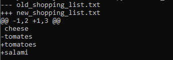
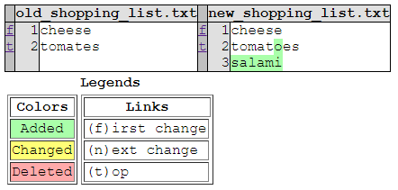

# diff-tool

A tool to show Git like file diffs on command line or in HTML format.

## Getting Started

[Python](https://www.python.org/) is required to run *diff-tool*, there is no third-party dependency.

### To get output on command line

```shell script
python diff_tool.py old_shopping_list.html new_shopping_list.html
```

**Output**



### To get output in HTML format

```shell script
python diff_tool.py old_shopping_list.html new_shopping_list.html --html diff.html
```

**Output**



## License

The *diff-tool* is an open-source software licensed under the MIT [license](LICENSE).
